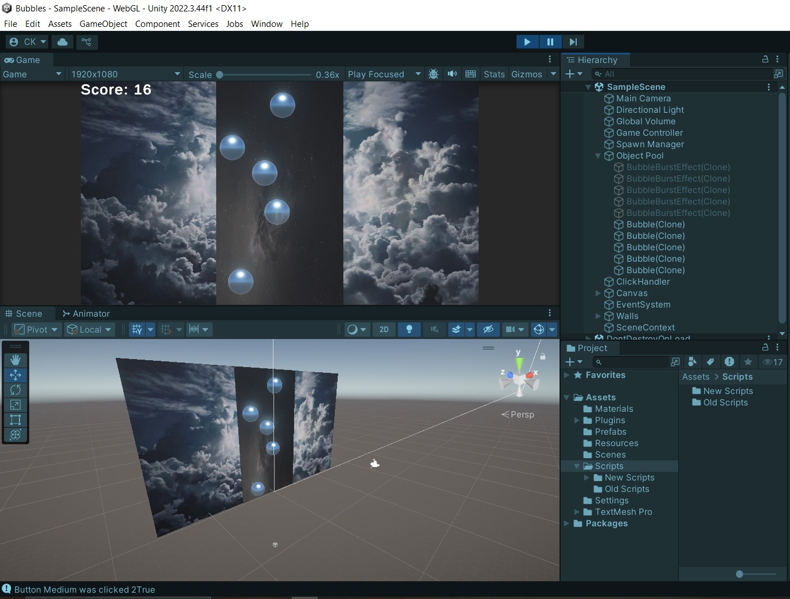
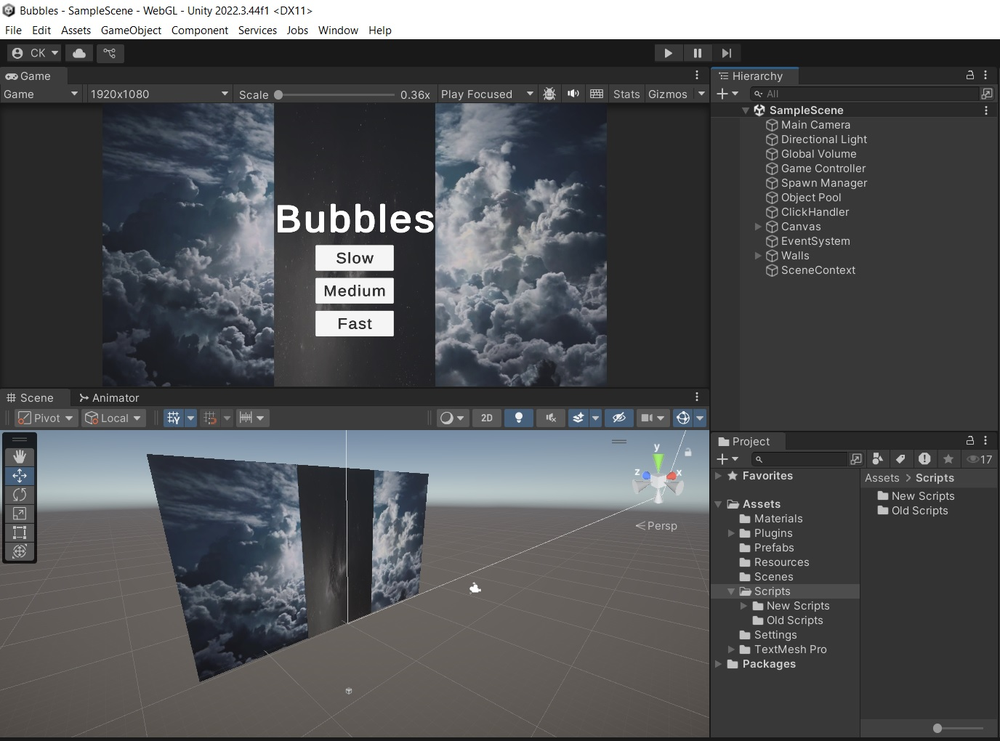

# BubblePop: Рефакторинг и применение паттернов проектирования
> Учебный проект, демонстрирующий применение архитектурных паттернов к существующей игре. Цель — показать, как правильно организовать код для его поддержки и расширения.

## 🎯 О проекте

**Было:** Простая игра-кликер, где игрок лопает пузыри ради очков. Код представлял собой монолитный "Спагетти-код" в одном скрипте.

**Стало:** Проект, переработанный с применением паттернов проектирования. Код разделен на независимые компоненты, что упрощает добавление новых функций и тестирование.

📌 **Цель проекта:** Не создать новую игру, а показать понимание принципов ООП и архитектуры Unity-проектов.

## 🧩 Примененные паттерны и решения

| Паттерн | Где применен | Зачем (решаемая проблема) |
| :--- | :--- | :--- |
| **DI / IoC (Zenject)** | Вся архитектура проекта. | Позволяет полностью разделить классы, это делает код невероятно гибким для расширения. |
| **MVC (Model-View-Controller)** | Вся архитектура проекта. | Разделил логику данных, отображение и управление. Теперь интерфейс можно менять, не трогая логику игры. |
| **Factory** | Создание пузырей. | Централизовал создание объектов. Теперь легко добавить новый тип пузыря, не меняя код в других классах. |
| **Observer** | Система подсчета очков и достижений. | UI и менеджер достижений "подписываются" на события, не зная друг о друге. Код слабо связан. |
| **Анимация (DOTween)** | Анимации UI-элементов | Это дало существенный прирост производительности по сравнению с стандартными Animator-контроллерами для простых эффектов и упростило написание анимации прямо в коде. |
| **Object Pooling** | Управление пузырями. | Использую пул объектов вместо Instantiate/Destroy. Это повышает производительность, так как объекты переиспользуются. |

## 🛠 Использованные возможности Unity

*   **Аниматор и Animator Controller:** Для анимации появления, лопания и исчезновения пузырей.
*   **Canvas и UI Toolkit:** Создан интерфейс для отображения очков и жизней.
*   **Система Particle System:** Эффекты взрыва при лопании пузыря.
*   **PlayerPrefs:** Сохранение рекорда (High Score) между сессиями.

## 🚀 Запуск проекта

1.  Убедитесь, что установлен Unity Hub и редактор Unity версии **2021.3 LTS** или выше.
2.  Клонируйте репозиторий.
3.  Откройте проект через Unity Hub, выбрав папку `BubblePop`.
4.  Откройте сцену `Scenes/MainGame.unity` и нажмите кнопку Play в Unity Editor.

## 🖼 Скриншоты

*Основной игровой процесс*

*Интерфейс*

---

⭐ **Важно:** Этот проект является частью моего портфолио и демонстрирует мой подход к написанию чистого и поддерживаемого кода. Буду рад конструктивной обратной связи!
